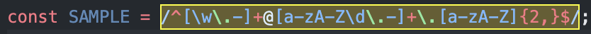
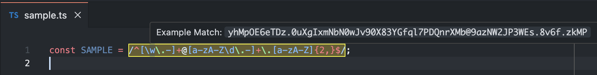

# Regex Insight

This extension identifies regex patterns used in code, highlights them in yellow, and quickly generates matching examples when you hover over them.

## Features

- **Pattern Highlighting:** Automatically identifies and highlights regex patterns in yellow for better visibility.

  

- **Hover Examples:** Provides matching examples for regex patterns when you hover over them, helping users understand the regex functionality.

  

## Requirements

- Visual Studio Code version 1.87.0 or later.
- Yarn package manager (install from [Yarn's official website](https://classic.yarnpkg.com/lang/en/docs/install)).

## Extension Settings

This extension contributes the following settings:

- `regexInsight.enable`: Enable/disable regex insight functionality.
- `regexInsight.highlightColor`: Customize the color used for highlighting regex patterns (default is yellow).

## Known Issues

- Highlighting may not work correctly with multi-line regex patterns.
- Some edge cases in complex regex patterns may not generate accurate examples.

## Release Notes

Users appreciate release notes as you update your extension.

### 1.0.0

Initial release of Regex Insight with basic pattern highlighting and hover examples.
